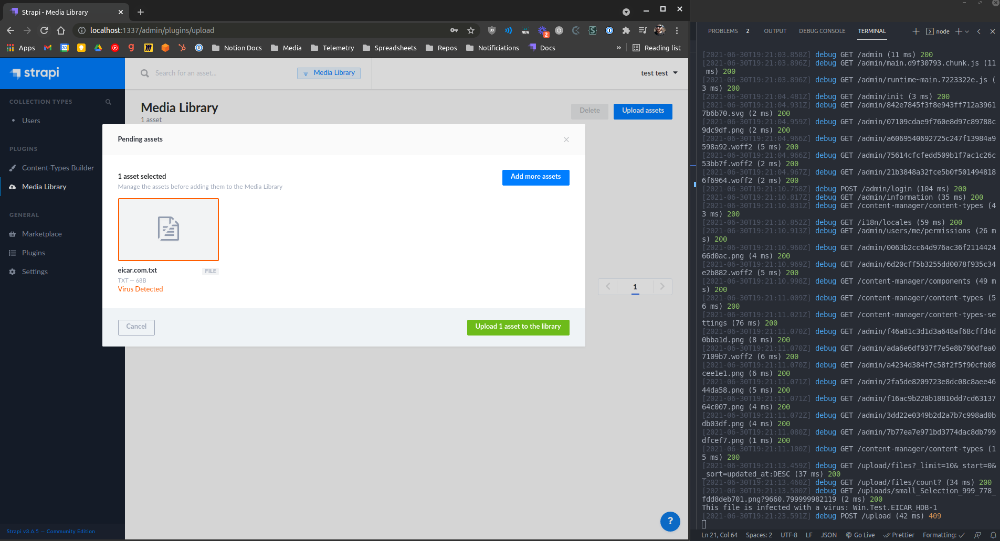

# Strapi ClamAV Virus detection provider

This is a sample application built on a custom provider code built by a 3rd party (can't name them).

My modifications here are to the upload plugin itself to add support for a custom HTTP409 Response Code (Conflict) to the file upload provider. This effectively returns a "human readable" error to the admin panel. It does require forking the entire upload plugin which has been moved to the [packages](./packages) directory.

Below is an example of the message:

This is done by adding the `virusError` function to the [upload plugin's error API](./packages/strapi-plugin-upload/errors.js)

Then calling that in the [clamav provider](./packages/strapi-provider-upload-clamav-proxy/lib/index.js)
